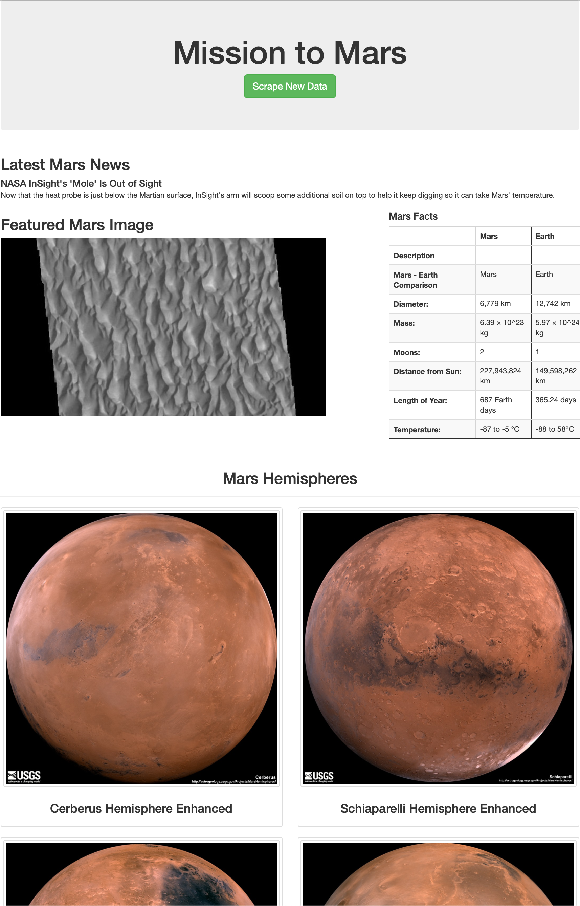

# Mission-to-Mars

## Overview:

In this project, I used BeautifulSoup and Splinter to scrape full-resolution images of Mars’s hemispheres and the titles of those images, store the scraped data on a Mongo database, use a web application (Flask) to display the data, and alter the design of the web app with Bootstrap to accommodate these images.

